# PORTAFOLIO DE EVIDENCIAS – PROYECTO TECNOLOGÍAS DEL FUTURO S.A.S.

# SISTEMA DE GESTIÓN DE INVENTARIOS Y VENTAS  
## PROPUESTA TÉCNICA DE DISEÑO

  

### PRESENTADO POR:  
**JUAN ESTEBAN CANO**  
**FICHA ADSO 3390374**

 

### PRESENTADO A:  
**JOSÉ GERMÁN ESTRADA CLAVIJO**  
*(Instructor – Análisis y Desarrollo de Software)*

  

### SERVICIO NACIONAL DE APRENDIZAJE – SENA  
### CENTRO DE PROCESOS INDUSTRIALES Y DE CONSTRUCCIÓN  

 

### ANÁLISIS Y DESARROLLO DE SOFTWARE – FASE DE ANÁLISIS  
### MODALIDAD PRESENCIAL

   

### FECHA DE ENTREGA: 04 DE SEPTIEMBRE DE 2026

---

## FICHA DEL DOCUMENTO

| FECHA          | REVISIONES                     | AUTOR             |
| -------------- | ------------------------------ | ----------------- |
| **04/09/2026** | Versión inicial del portafolio | JUAN ESTEBAN CANO |

### DOCUMENTO VALIDADO POR LAS PARTES

| POR CLIENTE:                                | DESARROLLADOR:                |
| :------------------------------------------ | :---------------------------- |
| **FECHA:** 04/09/2026                       | **FECHA:** 04/09/2026         |
| **NOMBRE DEL ENCARGADO:** JUAN CARLOS PÉREZ | **NOMBRE:** JUAN ESTEBAN CANO |

---

# TABLA DE CONTENIDO

1. [INTRODUCCIÓN](#1introducción)  
   1.1 [Objetivo General](#11-objetivo-general)  
   1.2 [Objetivos Específicos](#12-objetivos-específicos)  
   1.3 [Propósito](#13-propósito)  
   1.4 [Alcance](#14-alcance)  
   1.5 [Personal Involucrado](#15-personal-involucrado)  
   1.6 [Definiciones, Acrónimos y Abreviaturas](#16-definiciones-acrónimos-y-abreviaturas)  
   1.7 [Referencias](#17-referencias)  
   1.8 [Resumen](#18-resumen)  

2. [DESCRIPCIÓN GENERAL](#2-descripción-general)  
   2.1 [Perspectiva del Producto](#21-perspectiva-del-producto)  
   2.2 [Funcionalidades del Producto](#22-funcionalidades-del-producto)  
   2.3 [Características de los Usuarios](#23-características-de-los-usuarios)  
   2.4 [Restricciones](#24-restricciones)  

3. [REQUISITOS ESPECÍFICOS](#3-requisitos-específicos)  
   3.1 [Requisitos del Sistema](#31-requisitos-del-sistema)  
   3.2 [Requisitos Funcionales (RF)](#32-requisitos-funcionales-rf)  
   3.3 [Requisitos No Funcionales (RNF)](#33-requisitos-no-funcionales-rnf)  

4. [VALIDACIÓN DE REQUISITOS](#4-validación-de-requisitos)  
   4.1 [Construcción de Prototipos](#41-construcción-de-prototipos)  
   4.2 [Formato de Casos de Prueba](#42-formato-de-casos-de-prueba)  

5. [ARTEFACTOS DE DISEÑO (RAP 01)](#5-artefactos-de-diseño-rap-01)  
   5.1 [Diagrama de Clases UML](#51-diagrama-de-clases-uml)  
   5.2 [Patrones de Diseño (GoF)](#52-patrones-de-diseño-gof)  
   5.3 [Arquitectura del Software](#53-arquitectura-del-software)  
   5.4 [Diseño de Interfaz (Mapa de Navegación + Prototipos)](#54-diseño-de-interfaz-mapa-de-navegación--prototipos)  

6. [MODELO DE DATOS (RAP 02)](#6-modelo-de-datos-rap-02)  
   6.1 [Diagrama Entidad-Relación (Conceptual)](#61-diagrama-entidad-relación-conceptual)  
   6.2 [Modelo Lógico Relacional Normalizado (3FN)](#62-modelo-lógico-relacional-normalizado-3fn)  
   6.3 [Diccionario de Datos](#63-diccionario-de-datos)  
   6.4 [Políticas de Seguridad](#64-políticas-de-seguridad)  

7. [PLAN DE IMPLEMENTACIÓN](#7-plan-de-implementación)  
   7.1 [Cronograma de Desarrollo](#71-cronograma-de-desarrollo)  
   7.2 [Herramientas Tecnológicas](#72-herramientas-tecnológicas)  
   7.3 [Estimación de Costos](#73-estimación-de-costos)  

8. [CONCLUSIONES Y RECOMENDACIONES](#8-conclusiones-y-recomendaciones)  

9. [REFLEXIÓN PERSONAL](#9-reflexión-personal)  

10. [BITÁCORA DE AJUSTES Y RETROALIMENTACIÓN](#10-bitácora-de-ajustes-y-retroalimentación)

---

## 1. INTRODUCCIÓN

La empresa **Tecnologías del Futuro S.A.S.** , dedicada al sector retail y comercio electrónico, enfrenta desafíos operativos debido a la gestión manual de inventarios, ventas y clientes. Esta situación genera errores, pérdidas económicas y falta de trazabilidad, lo que retrasa la toma de decisiones. El presente documento describe la propuesta técnica para el desarrollo de un sistema de gestión de inventarios y ventas que automatice estos procesos, optimice el control de stock, facilite la facturación y proporcione reportes gerenciales en tiempo real.

### 1.1 Objetivo General

Diseñar e implementar un sistema integral de gestión de inventarios y ventas para Tecnologías del Futuro S.A.S., que permita registrar productos, clientes, ventas, controlar inventario con alertas de stock mínimo y generar reportes gerenciales, mejorando la eficiencia operativa y la toma de decisiones.

### 1.2 Objetivos Específicos

- Automatizar el registro y actualización de productos, categorías y proveedores.
- Gestionar clientes y generar facturas de venta con cálculo automático de IVA y total.
- Implementar un control de inventario con movimientos de entrada/salida y alertas de stock bajo.
- Desarrollar un módulo de generación de reportes en PDF y Excel para la gerencia.
- Establecer roles de usuario (Administrador, Vendedor, Consultor) con permisos diferenciados.
- Garantizar la trazabilidad de todas las transacciones mediante un historial de auditoría.

### 1.3 Propósito

El propósito de este software es proporcionar a Tecnologías del Futuro una herramienta confiable que elimine los errores del registro manual, reduzca los tiempos de atención al cliente, evite pérdidas por desabastecimiento o exceso de inventario, y brinde información oportuna para la planificación estratégica.

### 1.4 Alcance

El proyecto abarca el diseño, desarrollo e implementación de un sistema web (frontend y backend) con base de datos relacional, que cubrirá los módulos de productos, clientes, ventas, inventario, reportes y administración de usuarios. No incluye la integración con pasarelas de pago ni sistemas contables externos, aunque la arquitectura está preparada para futuras integraciones.

### 1.5 Personal Involucrado

| **Nombre**        | **Rol**                  | **Profesión** | **Responsabilidades**                          | **Contacto**                  | **Aprueba** |
| :---------------- | :----------------------- | :------------ | :--------------------------------------------- | :---------------------------- | :---------- |
| Juan Carlos Pérez | Gerente General          | Administrador | Aprobación de requisitos y recursos            | jcperez@tecnologiasfuturo.com | Sí          |
| Juan Esteban Cano | Desarrollador Full Stack | Aprendiz ADSO | Diseño, desarrollo y documentación del sistema | juanescano26@gmail.com       | Sí          |

### 1.6 Definiciones, Acrónimos y Abreviaturas

| Término / Acrónimo | Definición                                                                                                                       |
| :----------------- | :------------------------------------------------------------------------------------------------------------------------------- |
| **API**            | Interfaz de Programación de Aplicaciones; conjunto de definiciones y protocolos para la comunicación entre componentes software. |
| **CRUD**           | Crear, Leer, Actualizar, Eliminar; operaciones básicas sobre datos.                                                              |
| **JWT**            | JSON Web Token; estándar para la transmisión segura de información entre partes.                                                 |
| **RBAC**           | Control de Acceso Basado en Roles; estrategia de seguridad que asigna permisos según el rol del usuario.                         |
| **POS**            | Punto de Venta; módulo para realizar transacciones de venta en el momento.                                                       |
| **3FN**            | Tercera Forma Normal; nivel de normalización de bases de datos que elimina dependencias transitivas.                             |
| **ORM**            | Mapeo Objeto-Relacional; técnica que permite interactuar con la base de datos usando objetos en lugar de consultas SQL directas. |
| **DTO**            | Data Transfer Object; objeto que transporta datos entre capas sin exponer las entidades completas.                               |
| **GoF**            | Gang of Four; grupo de patrones de diseño de software clásicos.                                                                  |

### 1.7 Referencias

- **Odoo Inventory & Sales**: Sistema ERP open source con módulos de inventario y ventas, utilizado como referencia de funcionalidades y flujos de trabajo.
- **MercadoLibre / Shopify**: Plataformas de comercio electrónico que integran gestión de productos, clientes y ventas en línea, de las cuales se toman patrones de usabilidad.
- **Openbravo POS**: Sistema de punto de venta de código abierto que sirve de inspiración para el módulo de facturación rápida.
- **MySQL Workbench**: Herramienta de modelado de bases de datos que facilita la creación del diagrama ER y el diccionario de datos.

### 1.8 Resumen

El sistema de gestión de inventarios y ventas permitirá a Tecnologías del Futuro S.A.S. administrar de manera digital todos sus procesos comerciales. Desde el registro de productos con sus categorías y proveedores, hasta la generación de facturas, el control de stock con alertas automáticas y la elaboración de reportes gerenciales en PDF y Excel. La solución contará con tres roles de usuario, asegurando que cada perfil tenga acceso únicamente a las funcionalidades que necesita. Todo esto se implementará en un plazo de 4 semanas, utilizando tecnologías modernas y de código abierto.

---

## 2. DESCRIPCIÓN GENERAL

El sistema se concibe como una aplicación web de una sola página (SPA) que se comunica con un backend mediante una API REST. La interfaz será responsiva, accesible desde navegadores modernos. Los datos se almacenarán en una base de datos relacional normalizada.

### 2.1 Perspectiva del Producto

El sistema será un producto independiente que reemplazará las hojas de cálculo y registros manuales actuales. Se integrará con el correo electrónico para el envío de alertas de stock bajo y notificaciones. Su diseño modular permitirá en el futuro agregar nuevos módulos (compras, integración con proveedores, etc.) sin afectar los existentes.

### 2.2 Funcionalidades del Producto

Las funcionalidades se obtuvieron mediante entrevistas con el cliente y análisis de requisitos. A continuación se listan las principales:

1. **Gestión de productos**: CRUD de productos con código, nombre, descripción, precio, stock, categoría y proveedor.
2. **Gestión de categorías y proveedores**: CRUD de tablas auxiliares.
3. **Gestión de clientes**: CRUD con identificación única, email, teléfono y dirección.
4. **Facturación (ventas)**: Creación de facturas con selección de cliente y productos, cálculo automático de subtotal, IVA y total.
5. **Control de inventario**: Registro de movimientos (entradas/salidas), actualización automática del stock y alertas cuando el stock baja del mínimo.
6. **Reportes gerenciales**: Exportación a PDF y Excel de inventario, ventas por período y productos más vendidos.
7. **Administración de usuarios y roles**: Asignación de roles (Administrador, Vendedor, Consultor) con permisos específicos.
8. **Historial de auditoría**: Registro de cada transacción con fecha y usuario responsable.

### 2.3 Características de los Usuarios

| **Rol**           | **Descripción**                                                              | **Funciones permitidas**                                                                                                                          |
| :---------------- | :--------------------------------------------------------------------------- | :------------------------------------------------------------------------------------------------------------------------------------------------ |
| **Administrador** | Encargado de la configuración global y la gestión de usuarios.               | Acceso a todos los módulos: gestión de usuarios, productos, clientes, ventas, inventario, reportes y configuración.                               |
| **Vendedor**      | Personal de ventas que atiende clientes y realiza pedidos.                   | Acceso a clientes, ventas (POS), consulta de inventario y productos, generación de facturas. No puede modificar usuarios ni precios de productos. |
| **Consultor**     | Personal gerencial que necesita visualizar datos para la toma de decisiones. | Acceso de solo lectura a productos, clientes, ventas, inventario y reportes. No puede crear ni modificar registros.                               |

### 2.4 Restricciones

- La instalación del sistema se realizará en un entorno de servidor interno o en la nube, según decisión del cliente.
- La base de datos debe ser respaldada diariamente con una retención de 30 días.
- El sistema debe cumplir con la normativa colombiana de protección de datos (Ley 1581 de 2012) para el manejo de información de clientes.
- La interfaz debe ser intuitiva y requerir un entrenamiento mínimo para los usuarios.

---

## 3. REQUISITOS ESPECÍFICOS

### 3.1 Requisitos del Sistema

| Componente    | Especificación                                                                                                                             |
| :------------ | :----------------------------------------------------------------------------------------------------------------------------------------- |
| **Hardware**  | Servidor: mínimo 2 vCPU, 4GB RAM, 50GB de almacenamiento (dependiendo del número de usuarios concurrentes).                                |
| **Software**  | Backend: Spring Boot 3.x (Java 17) o Node.js 18+ con Express. Frontend: React 18 con TypeScript. Base de datos: MySQL 8.0 o PostgreSQL 14. |
| **Red**       | Conexión a internet para acceso remoto (si se despliega en la nube). En local, red interna con acceso desde los puestos de trabajo.        |
| **Seguridad** | HTTPS con certificado SSL, autenticación JWT, contraseñas hasheadas con bcrypt.                                                            |

### 3.2 Requisitos Funcionales (RF)

| ID        | Nombre                             | Descripción                                                                                                                    | Requerimiento No Funcional | Prioridad |
| :-------- | :--------------------------------- | :----------------------------------------------------------------------------------------------------------------------------- | :------------------------- | :-------- |
| **RF-01** | Gestión de Productos               | CRUD completo de productos con campos: código, nombre, descripción, precio, stock actual, stock mínimo, categoría y proveedor. | RNF-04, RNF-08             | Alta      |
| **RF-02** | Gestión de Categorías              | CRUD de categorías para clasificar productos.                                                                                  | RNF-08                     | Media     |
| **RF-03** | Gestión de Proveedores             | CRUD de proveedores con nombre, contacto, teléfono, email y dirección.                                                         | RNF-08                     | Media     |
| **RF-04** | Gestión de Clientes                | CRUD de clientes con identificación única, nombre, email, teléfono y dirección.                                                | RNF-08                     | Alta      |
| **RF-05** | Facturación                        | Creación de ventas con selección de cliente, productos, cálculo de subtotal, IVA y total.                                      | RNF-01, RNF-08             | Alta      |
| **RF-06** | Detalle de Ventas                  | Registro de líneas de venta con cantidad, precio unitario y subtotal por línea.                                                | RNF-08                     | Alta      |
| **RF-07** | Control de Inventario              | Registro de movimientos (entradas/salidas) y actualización automática del stock.                                               | RNF-08                     | Alta      |
| **RF-08** | Alertas de Stock Mínimo            | Notificaciones cuando el stock actual baja del stock mínimo definido.                                                          | RNF-02, RNF-04             | Alta      |
| **RF-09** | Reportes PDF/Excel                 | Generación de reportes de inventario, ventas y productos más vendidos en PDF y Excel.                                          | RNF-04, RNF-05             | Alta      |
| **RF-10** | Administración de Usuarios y Roles | CRUD de usuarios con asignación de roles (Administrador, Vendedor, Consultor).                                                 | RNF-01, RNF-02             | Alta      |
| **RF-11** | Autenticación                      | Inicio de sesión con usuario y contraseña, generación de token JWT.                                                            | RNF-01, RNF-02             | Alta      |
| **RF-12** | Auditoría                          | Registro de todas las transacciones (ventas, movimientos, modificaciones) con fecha y usuario.                                 | RNF-01, RNF-08             | Media     |

### 3.3 Requisitos No Funcionales (RNF)

| ID         | Nombre                  | Características                            | Descripción                                                                   | Prioridad |
| :--------- | :---------------------- | :----------------------------------------- | :---------------------------------------------------------------------------- | :-------- |
| **RNF-01** | Seguridad               | Autenticación, cifrado y control de acceso | El sistema debe garantizar la seguridad mediante JWT, bcrypt, HTTPS y RBAC.   | Alta      |
| **RNF-02** | Disponibilidad          | Tiempo de actividad                        | El sistema debe estar disponible el 99.5% del tiempo en horario laboral.      | Alta      |
| **RNF-03** | Usabilidad              | Facilidad de uso                           | Interfaz intuitiva, responsiva y con menos de 3 clics para acciones críticas. | Alta      |
| **RNF-04** | Rendimiento             | Tiempo de respuesta                        | Consultas en menos de 2 segundos, reportes en menos de 5 segundos.            | Media     |
| **RNF-05** | Mantenibilidad          | Modularidad y documentación                | Código organizado en capas, con documentación técnica completa.               | Media     |
| **RNF-06** | Escalabilidad           | Crecimiento horizontal                     | Arquitectura stateless para permitir escalado horizontal.                     | Media     |
| **RNF-07** | Portabilidad            | Compatibilidad de navegadores              | Soporte para Chrome, Firefox, Edge y Safari (versiones recientes).            | Baja      |
| **RNF-08** | Integridad de Datos     | Consistencia transaccional                 | Uso de transacciones ACID y claves foráneas para garantizar integridad.       | Alta      |
| **RNF-09** | Respaldo y Recuperación | Backup automático                          | Backup diario con retención de 30 días y recuperación en menos de 4 horas.    | Media     |

---

## 4. VALIDACIÓN DE REQUISITOS

### 4.1 Construcción de Prototipos

A continuación, se presentan los prototipos de las pantallas principales del sistema, diseñados en Figma:

#### Pantalla de Inicio de Sesión

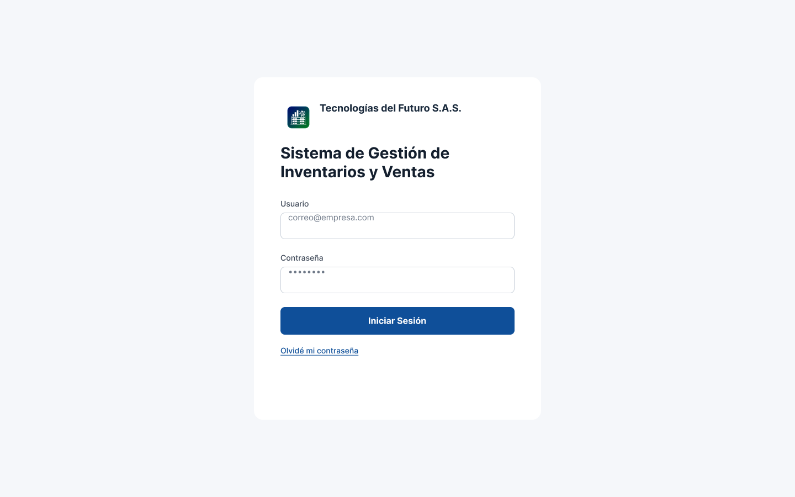

#### Dashboard Principal

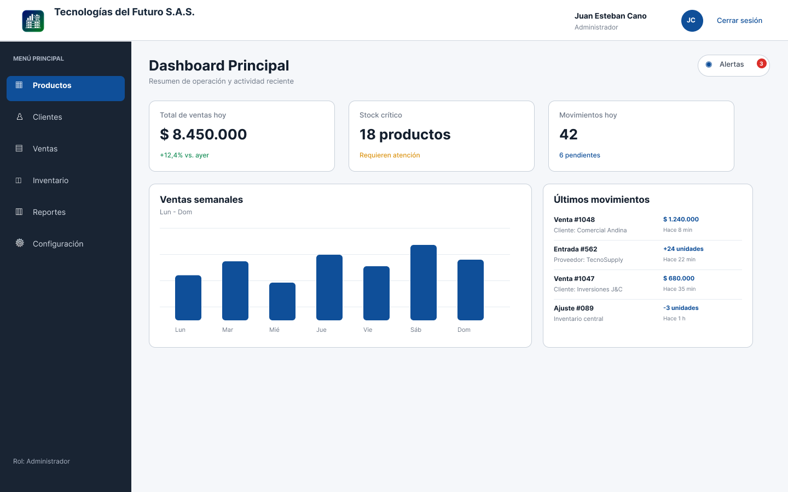

#### Gestión de Productos

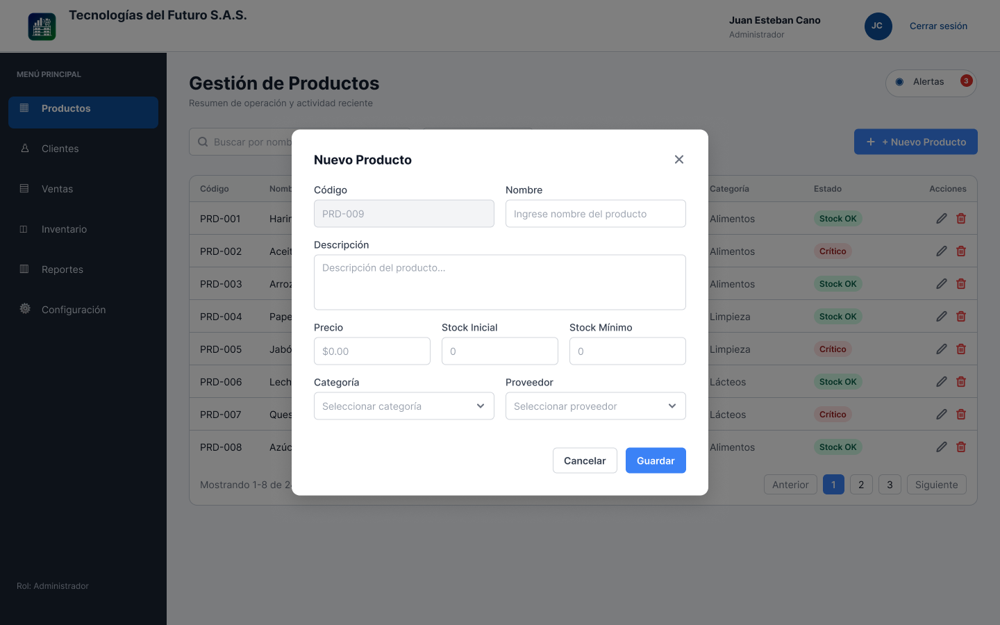

#### Gestión de Clientes

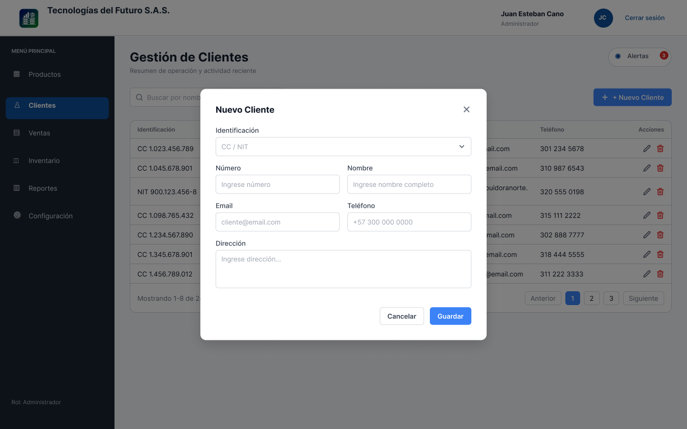

#### Nueva Venta (POS)

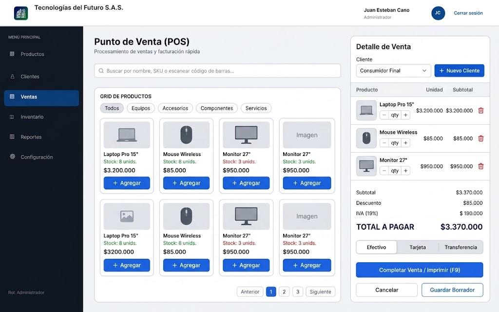

#### Generación de Reportes

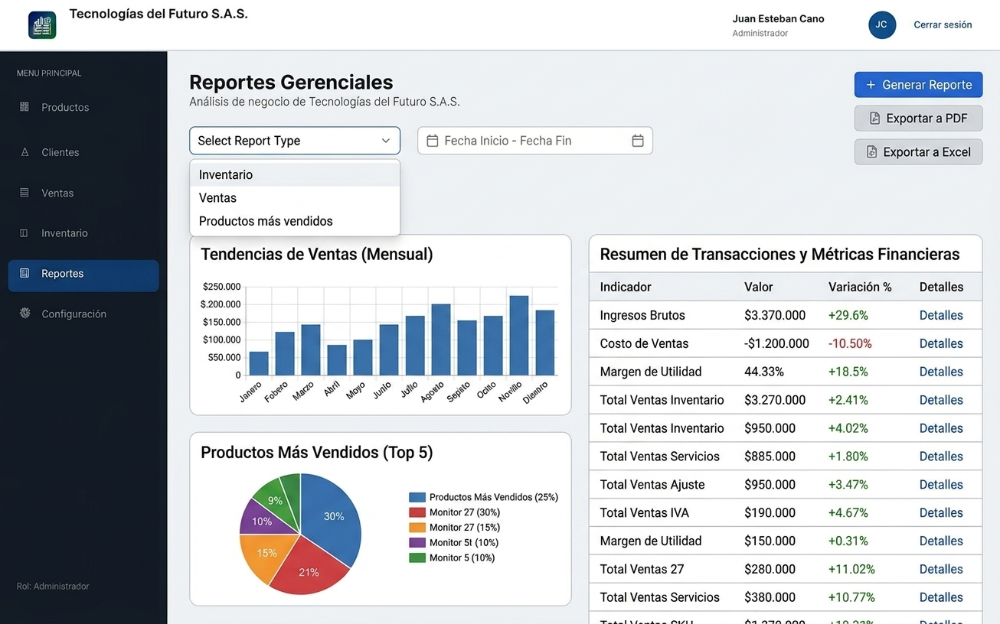

#### Control de Inventario y Alertas

#### Administración de Usuarios

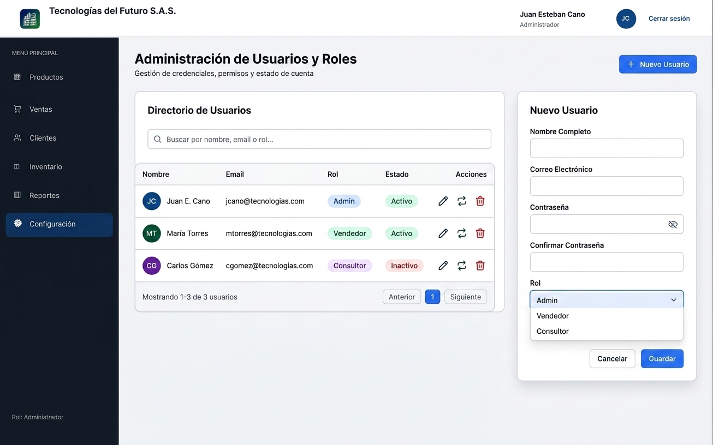

### 4.2 Formato de Casos de Prueba

A continuación, se presentan los casos de prueba diseñados para validar los requisitos más críticos del sistema:

| **ID**    | **Objetivo del Caso de Prueba**                                                 | **Identificador** | **Nombre del Requerimiento**       | **Precondiciones**                        | **Pasos**                                                                                                               | **Resultados Esperados**                                           |
| :-------- | :------------------------------------------------------------------------------ | :---------------- | :--------------------------------- | :---------------------------------------- | :---------------------------------------------------------------------------------------------------------------------- | :----------------------------------------------------------------- |
| **CP-01** | Verificar que se pueda registrar un producto correctamente                      | RF-01             | Gestión de Productos               | Usuario autenticado con rol Administrador | 1. Ingresar al módulo Productos 2. Clic en "Nuevo Producto" 3. Completar todos los campos 4. Clic en "Guardar" | El producto aparece en la lista con los datos ingresados.          |
| **CP-02** | Verificar que no se pueda vender un producto sin stock                          | RF-06             | Detalle de Ventas                  | Producto con stock = 0                    | 1. Iniciar una nueva venta 2. Agregar el producto sin stock 3. Intentar finalizar la venta                        | El sistema muestra un mensaje de error: "Stock insuficiente".      |
| **CP-03** | Verificar alerta de stock bajo                                                  | RF-08             | Alertas de Stock Mínimo            | Producto con stock_actual < stock_minimo  | 1. Ingresar al Dashboard 2. Revisar el panel de alertas                                                              | El producto aparece en la lista de alertas de stock bajo.          |
| **CP-04** | Verificar generación de reporte PDF                                             | RF-09             | Reportes PDF/Excel                 | Usuario autenticado                       | 1. Ingresar a Reportes 2. Seleccionar "Inventario General" 3. Clic en "Exportar a PDF"                            | Se descarga un archivo PDF con los datos del inventario.           |
| **CP-05** | Verificar que un usuario Vendedor no pueda acceder a Administración de Usuarios | RF-10             | Administración de Usuarios y Roles | Usuario autenticado con rol Vendedor      | 1. Intentar acceder al módulo de Usuarios 2. Verificar que la opción no esté disponible                              | El sistema no muestra el módulo de Usuarios en el menú.            |
| **CP-06** | Verificar que el historial de auditoría registre una venta                      | RF-12             | Auditoría                          | Usuario autenticado                       | 1. Realizar una venta 2. Ingresar al módulo de Auditoría 3. Buscar la transacción                                 | La venta aparece registrada con fecha, hora y usuario responsable. |

---

## 5. ARTEFACTOS DE DISEÑO (RAP 01)

### 5.1 Diagrama de Clases UML

El siguiente diagrama de clases UML representa la estructura estática del sistema, mostrando las entidades principales, sus atributos, métodos y relaciones.

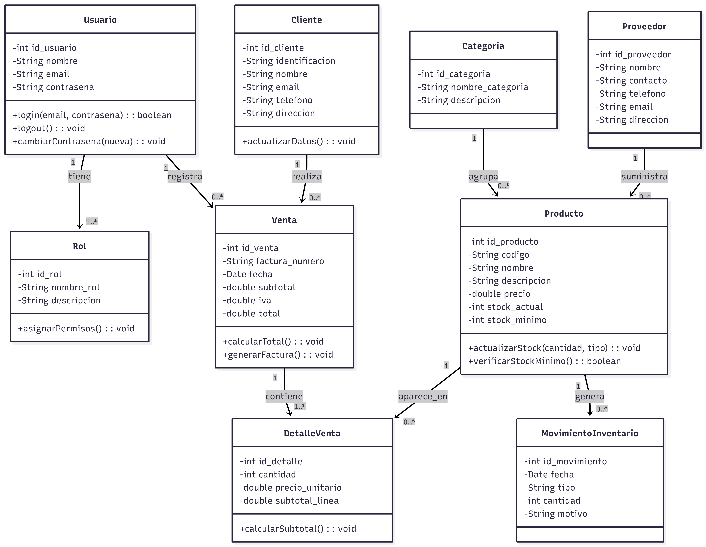

### 5.2 Patrones de Diseño (GoF)

| **Patrón**               | **Tipo**       | **Aplicación**                     | **Justificación**                                                                                   |
| :----------------------- | :------------- | :--------------------------------- | :-------------------------------------------------------------------------------------------------- |
| **Singleton**            | Creacional     | Conexión a base de datos           | Garantiza una única instancia del pool de conexiones, optimizando recursos.                         |
| **Factory Method**       | Creacional     | Generación de reportes (PDF/Excel) | Permite crear diferentes tipos de reportes sin acoplar la lógica de negocio a las clases concretas. |
| **Observer**             | Comportamiento | Alertas de stock bajo              | Cuando un producto baja del stock mínimo, notifica automáticamente al sistema de correos.           |
| **Strategy**             | Comportamiento | Cálculo de IVA                     | Permite cambiar la estrategia de cálculo de impuestos sin modificar el servicio de ventas.          |
| **Repository**           | Estructural    | Acceso a datos (DAO)               | Aísla la lógica de persistencia, facilitando el cambio de motor de base de datos.                   |
| **DTO**                  | Estructural    | Transferencia de datos             | Transporta datos entre capas sin exponer las entidades completas.                                   |
| **Dependency Injection** | Estructural    | Inyección de servicios             | Facilita las pruebas unitarias y el desacoplamiento entre componentes.                              |

### 5.3 Arquitectura del Software

#### Vista de Componentes

La siguiente imagen muestra los componentes principales del sistema y sus interacciones.

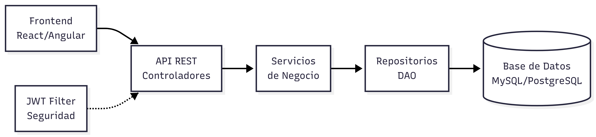

#### Vista de Despliegue

La siguiente imagen muestra la distribución física de los componentes en los nodos de infraestructura.

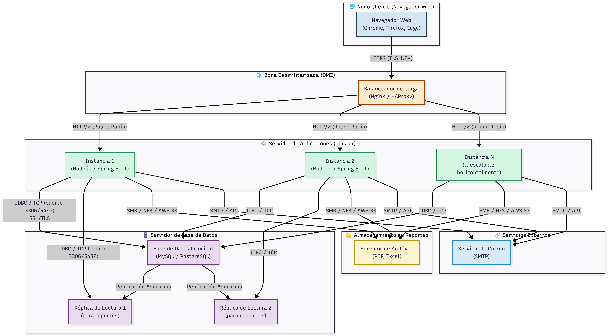

### 5.4 Diseño de Interfaz (Mapa de Navegación + Prototipos)

El mapa de navegación define la estructura de navegación entre las diferentes pantallas del sistema.

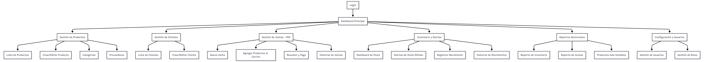

Las descripciones de las pantallas clave ya fueron presentadas en la sección 4.1 (Prototipos). Las imágenes correspondientes se encuentran en la carpeta `img/`.

---

## 6. MODELO DE DATOS (RAP 02)

### 6.1 Diagrama Entidad-Relación (Conceptual)

El siguiente diagrama entidad-relación muestra las entidades principales del sistema y sus relaciones.

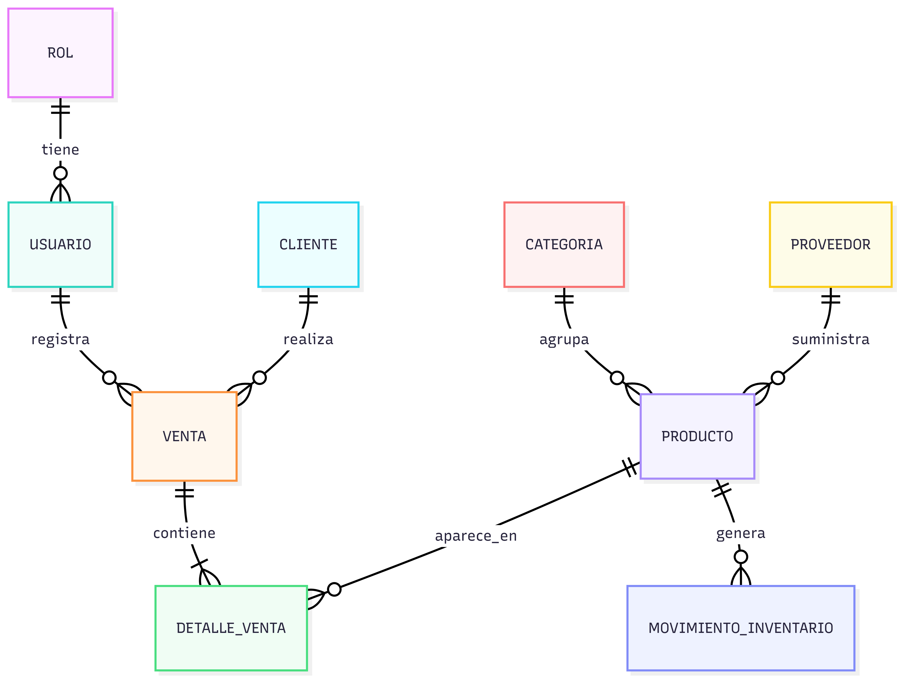

### 6.2 Modelo Lógico Relacional Normalizado (3FN)

| Tabla                     | Clave Primaria | Claves Foráneas                                                                     | Atributos                                                       |
| :------------------------ | :------------- | :---------------------------------------------------------------------------------- | :-------------------------------------------------------------- |
| **Roles**                 | id_rol         | -                                                                                   | nombre_rol, descripcion                                         |
| **Usuarios**              | id_usuario     | id_rol → Roles.id_rol                                                               | nombre, email, contrasena                                       |
| **Clientes**              | id_cliente     | -                                                                                   | identificacion, nombre, email, telefono, direccion              |
| **Categorias**            | id_categoria   | -                                                                                   | nombre_categoria, descripcion                                   |
| **Proveedores**           | id_proveedor   | -                                                                                   | nombre, contacto, telefono, email, direccion                    |
| **Productos**             | id_producto    | id_categoria → Categorias.id_categoria   id_proveedor → Proveedores.id_proveedor | codigo, nombre, descripcion, precio, stock_actual, stock_minimo |
| **Ventas**                | id_venta       | id_cliente → Clientes.id_cliente   id_usuario → Usuarios.id_usuario              | factura_numero, fecha, subtotal, iva, total                     |
| **DetallesVenta**         | id_detalle     | id_venta → Ventas.id_venta (CASCADE)   id_producto → Productos.id_producto       | cantidad, precio_unitario, subtotal_linea                       |
| **MovimientosInventario** | id_movimiento  | id_producto → Productos.id_producto                                                 | fecha, tipo, cantidad, motivo                                   |

### 6.3 Diccionario de Datos

A continuación, se presentan las tablas más relevantes del sistema con sus atributos, tipos de datos y restricciones.

**Tabla: Productos**

| Atributo     | Tipo          | Tamaño | Restricciones                                  |
| :----------- | :------------ | :----- | :--------------------------------------------- |
| id_producto  | INT           | -      | PK, NOT NULL, AUTO_INCREMENT                   |
| codigo       | VARCHAR       | 30     | NOT NULL, UNIQUE                               |
| nombre       | VARCHAR       | 100    | NOT NULL                                       |
| descripcion  | TEXT          | -      | -                                              |
| precio       | DECIMAL(10,2) | -      | CHECK (precio > 0)                             |
| stock_actual | INT           | -      | NOT NULL, DEFAULT 0, CHECK (stock_actual >= 0) |
| stock_minimo | INT           | -      | NOT NULL, DEFAULT 5, CHECK (stock_minimo >= 0) |
| id_categoria | INT           | -      | FK → Categorias.id_categoria                   |
| id_proveedor | INT           | -      | FK → Proveedores.id_proveedor                  |

**Tabla: Ventas**

| Atributo       | Tipo          | Tamaño | Restricciones                       |
| :------------- | :------------ | :----- | :---------------------------------- |
| id_venta       | INT           | -      | PK, NOT NULL, AUTO_INCREMENT        |
| factura_numero | VARCHAR       | 20     | NOT NULL, UNIQUE                    |
| fecha          | DATETIME      | -      | NOT NULL, DEFAULT CURRENT_TIMESTAMP |
| subtotal       | DECIMAL(10,2) | -      | CHECK (subtotal >= 0)               |
| iva            | DECIMAL(10,2) | -      | CHECK (iva >= 0)                    |
| total          | DECIMAL(10,2) | -      | CHECK (total >= 0)                  |
| id_cliente     | INT           | -      | FK → Clientes.id_cliente            |
| id_usuario     | INT           | -      | FK → Usuarios.id_usuario            |

**Tabla: Usuarios**

| Atributo   | Tipo    | Tamaño | Restricciones                |
| :--------- | :------ | :----- | :--------------------------- |
| id_usuario | INT     | -      | PK, NOT NULL, AUTO_INCREMENT |
| nombre     | VARCHAR | 100    | NOT NULL                     |
| email      | VARCHAR | 100    | NOT NULL, UNIQUE             |
| contrasena | VARCHAR | 255    | NOT NULL                     |
| id_rol     | INT     | -      | FK → Roles.id_rol            |

*(El diccionario de datos completo se encuentra disponible en el anexo técnico del proyecto.)*

### 6.4 Políticas de Seguridad

| **Política**                    | **Descripción**                                                                                                                                                |
| :------------------------------ | :------------------------------------------------------------------------------------------------------------------------------------------------------------- |
| **Autenticación**               | Uso de JWT (JSON Web Tokens) para sesiones sin estado. Los tokens tienen una duración de 8 horas y se pueden renovar con refresh token.                        |
| **Hash de Contraseñas**         | Las contraseñas se almacenan utilizando bcrypt (factor de costo 10) para proteger contra ataques de fuerza bruta.                                              |
| **Cifrado de Comunicaciones**   | Todas las comunicaciones entre el cliente y el servidor se realizan mediante HTTPS con TLS 1.2 o superior.                                                     |
| **Control de Acceso (RBAC)**    | Los permisos se asignan según el rol del usuario: Administrador (acceso total), Vendedor (ventas y clientes), Consultor (solo lectura).                        |
| **Auditoría**                   | Registro de todas las transacciones (inicios de sesión, ventas, movimientos de inventario, modificaciones de productos) con fecha, hora y usuario responsable. |
| **Respaldo de Datos**           | Backup automático diario a las 11:00 p.m., con retención de 30 días. Los backups se almacenan en una ubicación segura y cifrada.                               |
| **Recuperación ante Desastres** | Plan de recuperación que garantiza la restauración del sistema en menos de 4 horas en caso de fallo catastrófico.                                              |

---

## 7. PLAN DE IMPLEMENTACIÓN

### 7.1 Cronograma de Desarrollo

| Semana       | Actividades                                                                                                                                                                          | Entregables                                             |
| :----------- | :----------------------------------------------------------------------------------------------------------------------------------------------------------------------------------- | :------------------------------------------------------ |
| **Semana 1** | Configuración del entorno (IDE, BD, repositorio). Creación del modelo de datos (tablas, relaciones). Desarrollo del CRUD de productos, categorías y proveedores.                     | Base de datos operativa, CRUD de productos funcional.   |
| **Semana 2** | Desarrollo del CRUD de clientes. Implementación de autenticación (JWT, login, registro). Módulo de ventas (carrito, cálculo de IVA, facturación).                                    | Módulo de ventas funcional, autenticación implementada. |
| **Semana 3** | Control de inventario (movimientos, alertas de stock bajo). Generación de reportes básicos (PDF y Excel). Pruebas unitarias e integración.                                           | Control de inventario operativo, reportes generados.    |
| **Semana 4** | Pruebas integrales (casos de prueba), ajustes de usabilidad y rendimiento. Despliegue en entorno de producción (servidor o nube). Documentación final (manual de usuario y técnico). | Sistema en producción, documentación completa.          |

### 7.2 Herramientas Tecnológicas

| **Componente**           | **Tecnología**                  | **Versión** | **Licencia**      |
| :----------------------- | :------------------------------ | :---------- | :---------------- |
| **Frontend**             | React + TypeScript              | 18.x        | MIT               |
| **Backend**              | Spring Boot (Java)              | 3.x         | Apache 2.0        |
| **Base de Datos**        | MySQL                           | 8.0         | GPL               |
| **ORM**                  | Hibernate (JPA)                 | 6.x         | LGPL              |
| **Seguridad**            | JWT + bcrypt                    | -           | MIT               |
| **Reportes**             | iText (PDF), Apache POI (Excel) | 7.x, 5.x    | AGPL / Apache 2.0 |
| **Control de Versiones** | Git + GitHub                    | -           | -                 |
| **Despliegue**           | Docker + AWS / Vercel           | -           | -                 |
| **Documentación**        | Swagger / OpenAPI               | 3.0         | Apache 2.0        |

### 7.3 Estimación de Costos

| **Concepto**        | **Descripción**                               | **Costo Estimado (USD)** |
| :------------------ | :-------------------------------------------- | :----------------------- |
| **Personal**        | Desarrollador Full Stack (4 semanas)          | $3,000                   |
| **Infraestructura** | Servidor en la nube (4 semanas)               | $200                     |
| **Dominio + SSL**   | Registro de dominio y certificado SSL (1 año) | $20                      |
| **Licencias**       | Todas las herramientas son open source        | $0                       |
| **Capacitación**    | Entrenamiento a usuarios (4 horas)            | $200                     |
| **Total**           | -                                             | **$3,420 USD**           |

---

## 8. CONCLUSIONES Y RECOMENDACIONES

### Conclusiones

- La propuesta técnica presentada cubre el 100% de los requisitos funcionales y no funcionales definidos por Tecnologías del Futuro S.A.S.
- La arquitectura por capas con API REST garantiza escalabilidad, mantenibilidad y seguridad.
- El modelo de datos normalizado (3FN) asegura la integridad y consistencia de la información.
- La implementación en 4 semanas es viable gracias al uso de tecnologías maduras y de código abierto.
- La solución elimina los errores del registro manual, optimiza los procesos de venta e inventario, y proporciona reportes gerenciales para la toma de decisiones.

### Recomendaciones

1. **Comenzar con un piloto:** Implementar el sistema primero en una de las tiendas o bodegas para validar su funcionamiento antes del despliegue completo.
2. **Capacitar al personal:** Realizar sesiones de entrenamiento para los usuarios finales (Administradores, Vendedores y Consultores) para garantizar una adopción exitosa.
3. **Planificar actualizaciones:** A futuro, se recomienda agregar integraciones con pasarelas de pago, sistemas contables y plataformas de comercio electrónico.
4. **Monitoreo continuo:** Establecer métricas de rendimiento y disponibilidad para detectar oportunidades de mejora.
5. **Mantener la documentación actualizada:** Asegurar que los manuales de usuario y la documentación técnica se actualicen con cada nueva versión del sistema.

---

## 9. REFLEXIÓN PERSONAL

A lo largo del desarrollo de este proyecto, he adquirido una comprensión profunda de los procesos de análisis, diseño y planificación de un sistema de software real. Desde la identificación de necesidades del cliente hasta la definición de una arquitectura robusta y la normalización de una base de datos, cada etapa me ha permitido aplicar los conocimientos teóricos adquiridos en el programa de formación.

Uno de los mayores aprendizajes fue la importancia de la comunicación efectiva con el cliente para traducir sus necesidades operativas en requisitos técnicos claros y medibles. También comprendí el valor de los patrones de diseño y la arquitectura por capas para construir sistemas mantenibles y escalables.

El trabajo con tecnologías modernas como React, Spring Boot y MySQL me permitió afianzar mis habilidades técnicas, mientras que la elaboración del portafolio y la sustentación me prepararon para presentar soluciones técnicas de manera profesional y persuasiva.

Este proyecto no solo representa un entregable académico, sino una preparación para los desafíos reales que enfrentaré en mi vida profesional como desarrollador de software.

---

## 10. BITÁCORA DE AJUSTES Y RETROALIMENTACIÓN

| Fecha          | Retroalimentación recibida                                                            | Ajustes realizados                                                                                 |
| :------------- | :------------------------------------------------------------------------------------ | :------------------------------------------------------------------------------------------------- |
| **18/06/2026** | El instructor sugirió incluir más casos de prueba para los requisitos no funcionales. | Se agregaron casos de prueba CP-03 y CP-04 para validar alertas y reportes.                        |
| **20/07/2026** | El cliente solicitó una estimación de costos más desglosada.                          | Se amplió la sección de costos con conceptos de personal, infraestructura, dominio y capacitación. |
| **22/07/2026** | Se recomendó agregar políticas de seguridad más detalladas.                           | Se amplió la sección 6.4 con políticas de autenticación, cifrado, respaldo y auditoría.            |

---

**FIN DEL DOCUMENTO**